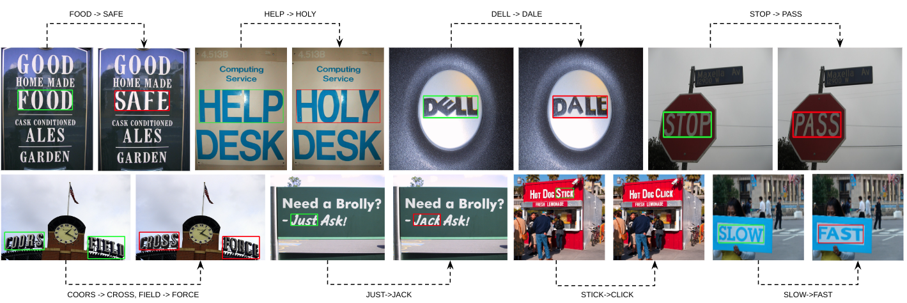

# :fire: :fire: On Manipulating Scene Text in the Wild with Diffusion Models (DBEST) WACV 2024 :fire: :fire:


## News
**2023.02.05** Pre-Release code :partying_face: :partying_face:

## TO-DO Lists
- [ ] Upload pre-trained weight 

## Requirements
1. In our implementation, we use text2image pre-trained weight from [Latent Diffusion Model (LDM)](https://github.com/CompVis/latent-diffusion). Please download the pre-trained weight from their official github. Alternatively, you can use directly from [Diffusers](https://huggingface.co/docs/diffusers/index) library (version 0.3.0).
2. Please note that our method requires a **cropped text**. You may use [EAST](https://pyimagesearch.com/2018/08/20/opencv-text-detection-east-text-detector/) for cropping the text or manual crop. 
3. For training LDM with Syntext, please download [Syntext](https://www.robots.ox.ac.uk/~vgg/data/scenetext/).

## Demo
go to `inner-loop/` directory and run
```
python prototype.py
```

## Run DBEST

#### Step 1: Generate Synthesized Text Scene Dataset 
You can download our SynText dataset on [this](https://drive.google.com/drive/folders/10DPeYjcpqO_Pxi3KC4kGitGW0Ytc3Eo1?usp=sharing).
Alternatively, you can generate by your own. Please refer to [srnet](https://github.com/Niwhskal/SRNet). We slightly change the code from its origin. Please refer to [generate-syntext](generate-syntext/) directory.

Please go to `generate-syntext/` directory and run 
```
python datagen.py
```

#### Step 2: Outer Loop Training
Before training the noise model, please initialize the weight from the pretrained [text2img](https://github.com/CompVis/latent-diffusion) from Latent Diffusion Model. Then, go to `outer-loop/` directory and run
```
python finetune.py
```

#### Step 2: Inner Loop Finetuning
For text recognition model, please use the origin weight from [ABINet](https://github.com/FangShancheng/ABINet). 
By using the pre-traind from *outer loop* process, go to `inner-loop/` directory and run
```
python prototype.py
```

# FAQs & Discussion
```
**Q: What is the sampling method used in this paper?**__
A: We use Denoising Diffusion Implicit Models (DDIM) and Pseudo Numerical Methods for Diffusion Models on Manifolds (PNDM) as implemented by diffusers and we used a normalized guidance scale (gs) 0-1._

```
